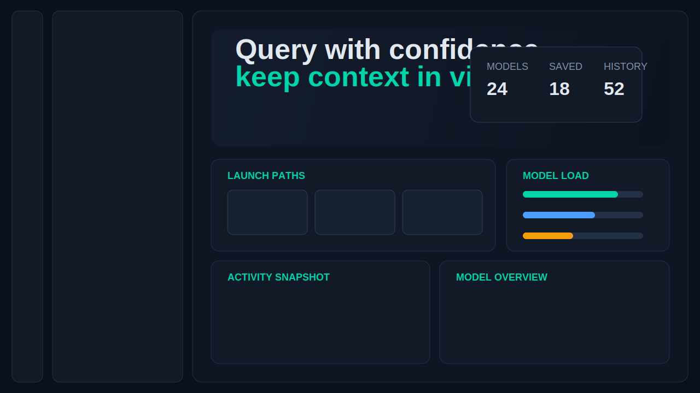
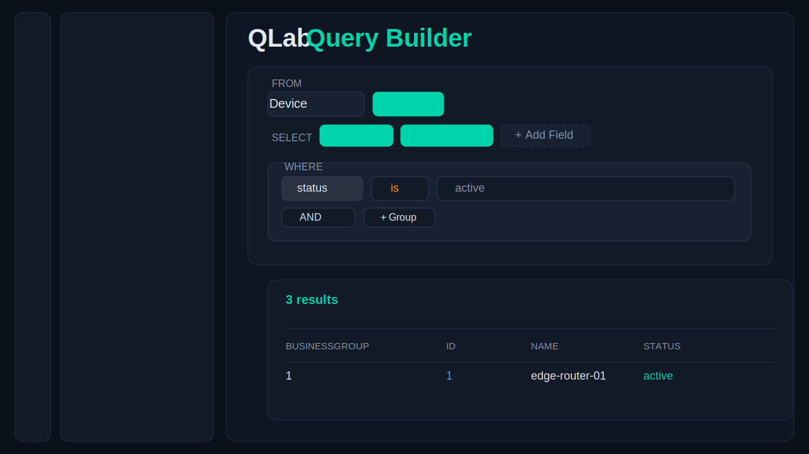

# django-qlab

Packaged QLab for Django REST Framework: dynamic querying, metadata discovery, saved queries, history, and a bundled React UI.

Repository:
[https://github.com/tabeahoehne132/django-qlab](https://github.com/tabeahoehne132/django-qlab)

## Screenshots

Dashboard:



Query builder:



## What ships

- Dynamic model querying with field selection and nested filters
- Metadata endpoint for fields, relations, operators and autocomplete
- Neighborhood endpoint for relation exploration
- Bundled React + TypeScript UI under `qlab.urls`
- Saved queries, run history and per-user UI settings
- Django admin integration for QLab persistence models

## Install

Normal package consumers do not need `vite`, `npm run dev`, or a frontend build. The published Python package already ships the compiled UI assets.

```bash
pip install git+https://github.com/tabeahoehne132/django-qlab.git
```

Add the app:

```python
INSTALLED_APPS = [
    "django.contrib.staticfiles",
    "rest_framework",
    "drf_spectacular",
    "qlab",
]
```

Mount the packaged UI:

```python
from django.urls import include, path

urlpatterns = [
    path("qlab/", include("qlab.urls")),
]
```

Optional: enforce a login redirect for the packaged UI by subclassing `QLabView`:

```python
from django.urls import include, path
from django.contrib.auth.mixins import LoginRequiredMixin
from rest_framework import permissions

from qlab.views import QLabView
from qlab.api_views import QLabFrontendApiViewSet


class SecuredQLabView(LoginRequiredMixin, QLabView):
    login_url = "/django/admin/login/"


class ScopedQLabViewSet(QLabFrontendApiViewSet):
    permission_classes = [permissions.IsAuthenticated]

    def get_queryset(self, model):
        return model.objects.filter(business_group=self.request.user.business_group)


urlpatterns = [
    path("qlab/", SecuredQLabView.as_view(), name="qlab"),
    path("qlab/", include("qlab.urls")),
    path(
        "qlab/api/query/",
        ScopedQLabViewSet.as_view({"post": "post"}),
        name="qlab-custom-query",
    ),
]
```

Use the custom `QLabFrontendApiViewSet` only if you need queryset scoping per user, tenant, or business group.

Collect static files if your project requires it:

```bash
python manage.py collectstatic
```

Then open `/qlab/` in your Django project.

## Consumer flow

For users of the package, the setup is only:

1. `pip install django-qlab`
2. add `qlab` to `INSTALLED_APPS`
3. include `qlab.urls`
4. run `collectstatic`
5. open `/qlab/`

No separate frontend server is required.

## API surface

Built-in routes exposed by `qlab.urls`:

- `POST /qlab/api/query/`
- `POST /qlab/api/metadata/`
- `POST /qlab/api/neighborhood/`
- `GET /qlab/api/bootstrap/`
- `GET/PATCH /qlab/api/settings/`
- `GET/POST /qlab/api/saved-queries/`
- `GET/PATCH/DELETE /qlab/api/saved-queries/<id>/`
- `POST /qlab/api/saved-queries/<id>/run/`
- `GET /qlab/api/history/`
- `GET /qlab/`

## UI capabilities

- Home dashboard with model counts, saved-query count and activity snapshot
- Query builder with:
  - field picker
  - nested `(a or b) and (x or y)` groups
  - CSV export
  - JSON copy
- Models browser with field and relation inspection
- Saved queries tab with create, update, delete, bulk delete and run
- History tab with replay, save-from-history and sidebar filters
- Docs and settings views
- First-use onboarding tour
- Light and dark mode

## Local frontend development

This section is only for maintainers working on the packaged UI itself.

```bash
cd frontend
npm install
npm run dev
```

To rebuild the bundled assets into `qlab/static/qlab/`:

```bash
cd frontend
npm run build
```

Or use the helper script from the repo root:

```bash
./scripts/build_package_ui.sh
```

## Maintainer release flow

Before publishing a new package version:

1. rebuild the packaged UI assets
2. verify the generated files in `qlab/static/qlab/`
3. build the Python distribution

```bash
./scripts/build_package_ui.sh
python -m build
```

The frontend build is done by the package maintainer, not by package consumers.

## Local demo project

A gitignored local demo project lives in `.local-demo/`.

Run it like this:

```bash
cd .local-demo
python manage.py migrate
python manage.py seed_demo_data
python manage.py runserver 8054
```

Then open:

[http://127.0.0.1:8054/qlab/](http://127.0.0.1:8054/qlab/)

## Admin

The package registers these models in Django admin:

- `QLabUserSettings`
- `SavedQuery`
- `QueryRunHistory`

## Example query payload

```json
{
  "model": "Device",
  "app_label": "demoapp",
  "select_fields": ["id", "name", "status"],
  "filter_fields": {
    "and_operation": [
      {
        "or_operation": [
          { "field": "status", "op": "is", "value": "active" },
          { "field": "status", "op": "is", "value": "maintenance" }
        ]
      },
      {
        "or_operation": [
          { "field": "region", "op": "is", "value": "DE" },
          { "field": "region", "op": "is", "value": "AT" }
        ]
      }
    ]
  },
  "page": 1,
  "page_size": 100
}
```

## Optional settings

```python
QLAB_SETTINGS = {
    "DEFAULT_APP_LABEL": "myapp",
    "PAGE_SIZE": 100,
    "MAX_PAGE_SIZE": 500,
    "MAX_RELATION_DEPTH": 2,
    "MAX_FILTER_CONDITIONS": 10,
    "MAX_NODES": 100,
    "ALLOWED_APPS": [],
    "RESTRICTED_MODELS": [],
}
```
