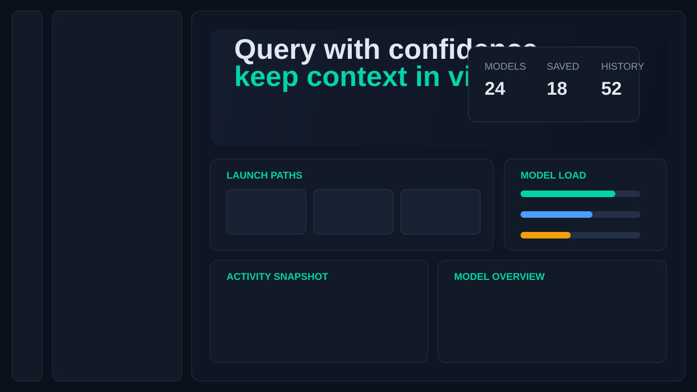
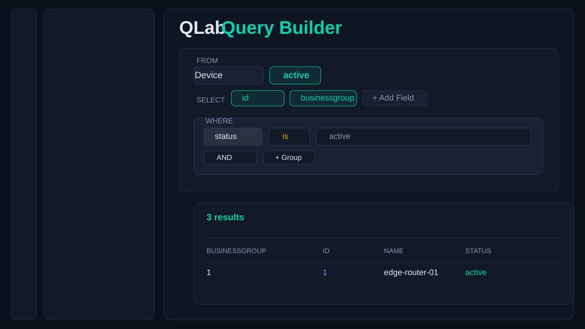

# django-qlab

Dynamic query API and bundled React UI for Django REST Framework.
Inspect model data, run filtered queries, save and replay them — no custom views required.

[](https://pypi.org/project/django-qlab/)
[](https://pypi.org/project/django-qlab/)
[](https://pypi.org/project/django-qlab/)
[](LICENSE)

---

## Screenshots

Dashboard:



Query builder:



---

## What ships

- Dynamic model querying with field selection and nested AND / OR / NOT filters
- Metadata endpoint — fields, types, relations, operators and autocomplete
- Neighborhood endpoint for relation exploration
- Bundled React + TypeScript UI served directly from `qlab.urls`
- Saved queries with create, update, delete and bulk operations
- Query run history with replay and save-from-history
- Per-user settings stored in the database
- Django admin integration for all persistence models

---

## Install

```bash
pip install django-qlab
```

Add the required apps:

```python
# settings.py
INSTALLED_APPS = [
    ...
    "django.contrib.staticfiles",
    "rest_framework",
    "drf_spectacular",
    "qlab",
]
```

Mount the URLs:

```python
# urls.py
from django.urls import include, path

urlpatterns = [
    ...
    path("qlab/", include("qlab.urls")),
]
```

Run migrations and collect static files:

```bash
python manage.py migrate
python manage.py collectstatic
```

Open `/qlab/` in your browser — done.

---

## Setup in 5 steps

1. `pip install django-qlab`
2. Add `qlab` (and its dependencies) to `INSTALLED_APPS`
3. Include `qlab.urls` in your URL config
4. `python manage.py migrate && python manage.py collectstatic`
5. Open `/qlab/`

No separate frontend server. No npm. The compiled UI ships with the package.

---

## Optional: login protection

Subclass `QLabView` to enforce authentication on the UI entrypoint:

```python
# urls.py
from django.contrib.auth.mixins import LoginRequiredMixin
from django.urls import include, path
from qlab.views import QLabView

class SecuredQLabView(LoginRequiredMixin, QLabView):
    login_url = "/admin/login/"

urlpatterns = [
    path("qlab/", SecuredQLabView.as_view(), name="qlab"),
    path("qlab/", include("qlab.urls")),
]
```

---

## Optional: queryset scoping

Override `QLabFrontendApiViewSet` to scope queries per user, tenant or business group:

```python
from rest_framework import permissions
from qlab.api_views import QLabFrontendApiViewSet

class ScopedQLabViewSet(QLabFrontendApiViewSet):
    permission_classes = [permissions.IsAuthenticated]

    def get_queryset(self, model):
        return model.objects.filter(tenant=self.request.user.tenant)
```

Then mount the scoped ViewSet before the default `qlab.urls` include:

```python
urlpatterns = [
    path("qlab/", SecuredQLabView.as_view(), name="qlab"),
    path("qlab/api/query/", ScopedQLabViewSet.as_view({"post": "post"}), name="qlab-query"),
    path("qlab/", include("qlab.urls")),
]
```

---

## Settings

Add a `QLAB_SETTINGS` dict to your Django settings to override defaults:

```python
# settings.py
QLAB_SETTINGS = {
    "DEFAULT_APP_LABEL": "myapp",   # pre-select this app in the UI
    "PAGE_SIZE": 100,               # default page size
    "MAX_PAGE_SIZE": 500,           # hard cap per request
    "MAX_RELATION_DEPTH": 2,        # how deep relation graphs expand
    "MAX_FILTER_CONDITIONS": 10,    # max filter nodes per query
    "MAX_NODES": 100,               # max records returned by neighborhood
    "ALLOWED_APPS": [],             # restrict to specific app labels (empty = all)
    "RESTRICTED_MODELS": [],        # block specific model names globally
}
```

---

## API surface

All routes are mounted relative to the prefix you chose (e.g. `/qlab/`):

| Method | Path | Description |
|---|---|---|
| `GET` | `/` | Bundled React UI |
| `GET` | `/api/bootstrap/` | Initial data load (models, settings) |
| `POST` | `/api/query/` | Run a filtered, paginated query |
| `POST` | `/api/metadata/` | Model field and relation schema |
| `POST` | `/api/neighborhood/` | Relation graph for a set of records |
| `GET / PATCH` | `/api/settings/` | Per-user UI settings |
| `GET / POST` | `/api/saved-queries/` | List and create saved queries |
| `GET / PATCH / DELETE` | `/api/saved-queries/<id>/` | Manage a single saved query |
| `POST` | `/api/saved-queries/<id>/run/` | Execute a saved query |
| `GET` | `/api/history/` | Query run history |

### Example query payload

```json
{
  "model": "Device",
  "app_label": "myapp",
  "select_fields": ["id", "name", "status", "region"],
  "filter_fields": {
    "and_operation": [
      {
        "or_operation": [
          { "field": "status", "op": "is", "value": "active" },
          { "field": "status", "op": "is", "value": "maintenance" }
        ]
      },
      {
        "or_operation": [
          { "field": "region", "op": "is", "value": "DE" },
          { "field": "region", "op": "is", "value": "AT" }
        ]
      }
    ]
  },
  "page": 1,
  "page_size": 100
}
```

---

## UI capabilities

- **Dashboard** — model counts, saved query count and recent activity
- **Query builder** — field picker, nested `(a or b) and (x or y)` filter groups, CSV export, JSON copy
- **Models browser** — field types, nullability, filterable flags, relation inspection
- **Saved queries** — create, update, delete, bulk delete and run from the UI
- **History** — replay past runs, save from history, filter by model and time range
- **Settings** — page size, default app, theme
- **Light and dark mode**

---

## Django admin

The package registers the following models in Django admin:

| Model | Description |
|---|---|
| `QLabUserSettings` | Per-user theme, page size and active tab |
| `SavedQuery` | Stored query payloads with metadata |
| `QueryRunHistory` | Execution log with status, duration and result snapshot |

---

## Requirements

| Package | Version |
|---|---|
| Python | ≥ 3.9 |
| Django | ≥ 4.0 |
| djangorestframework | ≥ 3.14 |
| pydantic | ≥ 2.0 |
| drf-spectacular | ≥ 0.26 |

---

## Frontend development

This section is for maintainers working on the UI itself. Package consumers do not need npm.

```bash
cd frontend
npm install
npm run dev       # dev server with HMR
npm run build     # write compiled assets to qlab/static/qlab/
```

Or use the helper script from the repo root:

```bash
./scripts/build_package_ui.sh
```

---

## Release

1. Bump the version in `pyproject.toml` and `setup.py`
2. Run the release preparation script:

```bash
./scripts/prepare_release.sh <version>
```

3. Commit, tag and push to GitHub
4. Create the GitHub release
5. Publish to PyPI:

```bash
./scripts/publish_pypi.sh
```

See [docs/release-process.md](docs/release-process.md) for detailed guidance.

---

## Local demo

A gitignored demo project lives in `.local-demo/`:

```bash
cd .local-demo
python manage.py migrate
python manage.py seed_demo_data
python manage.py runserver 8054
```

Then open [http://127.0.0.1:8054/qlab/](http://127.0.0.1:8054/qlab/).

---

## License

MIT
